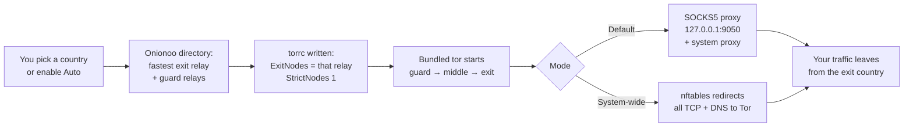

<div align="center">

# 🛡️ VPN Desk

**Pick a country. Browse through Tor. No account, no subscription.**

A modern desktop app that starts a bundled [Tor](https://www.torproject.org) client with a **strict exit in the country you choose**, shows your real and exit locations on a live map, ranks countries by **live speed estimates**, and can optionally route **every app on your computer** through Tor.

[](https://github.com/sandipbera35/vpndesk/releases)
[](LICENSE)


[Download](https://github.com/sandipbera35/vpndesk/releases) · [Features](#-features) · [How it works](#-how-it-works) · [System-wide mode](#-system-wide-mode-linux) · [Build from source](#-build-from-source) · [FAQ](#-faq--limitations)

</div>

---

## ✨ Features

| | |
|---|---|
| 🌍 **Country exits** | Choose from dozens of countries. Tor is configured with `ExitNodes` pinned to the fastest relay there and `StrictNodes 1`, so you never silently fall back to another country. |
| ⚡ **Live speed estimates** | Every minute the app measures real round-trip time to relays in each country, caps it by relay bandwidth, and calibrates against speeds you have actually measured through Tor. The sidebar shows `~Mbps · ms` per country, always up to date. |
| 🤖 **Auto (fastest) mode** | One click and VPN Desk always uses the highest-speed location, switching only when another is **≥ 25 % faster** and at most every **5 minutes**, so it never flaps. |
| 🔁 **Leak-free location switching** | Changing country edits the live Tor config instead of restarting it. The proxy never drops, so your real IP is not exposed mid-switch. |
| 🗺️ **Live world map** | Highlights the selected country and pins your **real IP** and **exit IP** at their locations with animated pins, ripples and a flowing link between them. Works fully offline (bundled Natural Earth data). |
| 🛡️ **System-wide mode** *(optional, Linux)* | Redirects **all** TCP and DNS from **every app** into Tor with an `nftables` transparent proxy, on GNOME, KDE or any desktop. Asks for administrator permission once, in the app. |
| 📦 **Nothing else to install** | Tor is bundled inside every package. Install the app and it works. |
| 🎨 **Polished, responsive UI** | Glass-style dark interface that adapts from a small window to a large one, with no scroll bars, mac-style window controls and an animated About page. |
| 🔒 **No accounts, no telemetry** | The app only talks to the Tor network, the Tor Project relay directory, IP-lookup and speed-test services. |

---

## 📥 Install

Download the package for your machine from the [**Releases**](https://github.com/sandipbera35/vpndesk/releases) page:

| Your system | Package |
|---|---|
| Debian / Ubuntu / Mint, Intel/AMD | `vpn-desk_<version>_amd64.deb` |
| Debian / Ubuntu / Mint, ARM64 | `vpn-desk_<version>_arm64.deb` |
| Fedora / RHEL / openSUSE, Intel/AMD | `vpn-desk-<version>-1.x86_64.rpm` |
| Fedora / RHEL / openSUSE, ARM64 | `vpn-desk-<version>-1.aarch64.rpm` |

```bash
# Debian / Ubuntu  (use the file name you downloaded)
sudo apt install ./vpn-desk_<version>_amd64.deb

# Fedora / RHEL / openSUSE
sudo dnf install ./vpn-desk-<version>-1.x86_64.rpm
```

Always take the **latest** release. (`v1.0.1` packages installed files with the wrong owner; use `v1.0.2` or newer.)

Then launch **VPN Desk** from your application menu (or run `/opt/vpn_desk/vpn_desk`).

> **Requirements:** a desktop Linux with GTK 3. `nftables` and `polkit` are only needed for the optional [system-wide mode](#-system-wide-mode-linux); the packages declare them.

### Platform status

| Platform | Status |
|---|---|
| 🐧 Linux x86_64 | ✅ Built and tested |
| 🐧 Linux arm64 | ✅ Built by CI (Tor compiled from source); not yet run on real hardware |
| 🍎 macOS | 🚧 Project scaffolding and `.dmg` script included, **not yet built or tested** |
| 🪟 Windows | 🚧 Project scaffolding and installer script included, **not yet built or tested** |

---

## 🧭 How it works



1. **Choose a location.** Type a country, click one in the sidebar, or turn on **Auto**.
2. **Find the best relays.** The app asks the Tor Project's Onionoo directory for the highest-bandwidth exit in that country and a set of fast guards, so the single shared circuit is as quick as Tor allows.
3. **Start Tor.** It writes a `torrc` that pins that exit with `StrictNodes 1` and launches the bundled `tor`. Tor builds a three-hop circuit: *guard → middle → exit*. If you close the app, Tor exits with it (`__OwningControllerProcess`).
4. **Route your traffic.** Tor opens a local **SOCKS5** proxy on `127.0.0.1:9050`. The app also points your desktop's system proxy at it (GNOME) so proxy-aware apps use it automatically. In [system-wide mode](#-system-wide-mode-linux) a firewall rule covers every app.
5. **Verify.** The exit IP is looked up *through Tor* and shown beside your real IP, with both pinned on the map.
6. **Stay fast.** Estimates refresh every minute; with Auto on, the app moves to a clearly faster location without ever dropping the proxy.
7. **Disconnect.** Tor stops and your proxy / firewall settings are restored.

### Speed estimation

Tor throughput is dominated by round-trip distance to the exit region and capped by the exit relay's bandwidth. Rather than hard-coding a number, the app:

- probes the **real TCP round-trip time** to each country's top exit relays, live,
- caps the result by the relay's observed bandwidth,
- derives its calibration constant **from speeds you have really measured through Tor** (median of *speed × RTT*), so the estimates adapt to *your* connection,
- replaces an estimate with your measured value as soon as you connect to that country.

---

## 🛡️ System-wide mode (Linux)

By default VPN Desk is a **local SOCKS5 proxy**: only apps that honour the system proxy go through Tor. Many tools (CLI programs, games, torrent clients) ignore it. **System-wide mode** closes that gap.

Turn it on with the **System-wide** switch in the main card. The app explains the change, and when you press **Connect** your system shows one standard administrator-password prompt.

| What it does | How |
|---|---|
| Sends **all TCP** to Tor | `nftables` NAT rule redirects outgoing TCP to Tor's `TransPort` (9040) |
| Sends **all DNS** to Tor | UDP port 53 redirected to Tor's `DNSPort` (5353): no DNS leaks |
| Keeps Tor itself reachable | Tor runs as a dedicated `vpndesk` system user that is excluded from the redirect |
| Blocks what Tor can't carry | Other UDP (QUIC/HTTP3, games, VoIP) and **IPv6** are dropped, so nothing leaks around Tor |
| Leaves your LAN alone | `192.168.x.x`, `10.x.x.x`, `172.16/12`, link-local and DHCP stay direct |
| **Fail-closed** | If Tor crashes, traffic stays **blocked** and a red **Restore** banner appears; nothing leaks. Closing the app or pressing Disconnect restores normal networking automatically |

It works the same on GNOME, KDE and any other Linux desktop because it uses the firewall, not a desktop-specific proxy setting.

**Security design**
- The privileged part is a tiny shell helper, `vpndesk-net`, launched through **polkit (`pkexec`)**. It is installed root-owned at `/opt/vpn_desk/vpndesk-net`.
- It takes **no file paths from the caller**: it finds Tor next to itself and accepts only an **allowlist of `torrc` directives** from the unprivileged app.
- Tor itself never runs as root; the app talks to it over a password-protected control port bound to `127.0.0.1`.

> ⚠️ Running `sudo systemctl restart nftables` (which flushes the whole ruleset) while connected removes the firewall table and will leak. Press **Disconnect** first.

---

## 🧱 Tech stack (all open source)

| Component | Purpose | License |
|---|---|---|
| [Tor](https://www.torproject.org) | Anonymity network and the `tor` client (official Tor Expert Bundle; compiled from source on arm64) | BSD-3-Clause |
| [Flutter](https://flutter.dev) / Dart | UI toolkit and language | BSD-3-Clause |
| [libevent](https://libevent.org), [OpenSSL](https://www.openssl.org), [zlib](https://zlib.net) | Libraries bundled with Tor | BSD-3 / Apache-2.0 / zlib |
| [bitsdojo_window](https://pub.dev/packages/bitsdojo_window) | Frameless window with custom controls | MIT |
| [socks5_proxy](https://pub.dev/packages/socks5_proxy) | Sends the app's own requests through Tor | MIT |
| [Natural Earth](https://www.naturalearthdata.com) | Country outlines for the offline map | Public domain |
| [Onionoo](https://metrics.torproject.org/onionoo.html) | Tor Project relay directory API | Public service |
| [nftables](https://netfilter.org/projects/nftables/) | Firewall used by system-wide mode | GPL-2.0 (system package) |

---

## 🗂️ Project layout

```
lib/
  main.dart          UI, connection logic, speed estimation, auto mode
  platform.dart      All OS-specific code (paths, tor lookup, proxy, control port, helper)
  world_map.dart     Offline animated world map (CustomPainter)
  about_page.dart    Animated About page
assets/              world.json (country shapes), profile.jpg
packaging/
  linux/             vpndesk-net helper + polkit policy
  flatpak/ snap/     Manifests (experimental)
fetch_tor.sh         Download + verify the official Tor Expert Bundle
build_tor_linux.sh   Build Tor from source (Linux arm64)
bundle_tor.sh        Put Tor + helper into the Linux release bundle
package.sh           Build .deb and .rpm
package_mac.sh       Build a .dmg (macOS, untested)
windows_installer.iss  Inno Setup script (Windows, untested)
.github/workflows/   CI: builds Linux x64 + arm64 packages on every v* tag
```

---

## 🔧 Build from source

You need the [Flutter SDK](https://docs.flutter.dev/get-started/install/linux) (stable) and the GTK 3 development files (`libgtk-3-dev` / `gtk3-devel`), plus `clang`, `cmake` and `ninja`.

```bash
git clone https://github.com/sandipbera35/vpndesk.git
cd vpndesk

flutter pub get
flutter build linux --release

./bundle_tor.sh                # bundle Tor + the system-wide helper
build/linux/x64/release/bundle/vpn_desk   # run it

./package.sh                   # optional: build .deb and .rpm into dist/
```

`./install.sh` installs the local build as a **VPN Desk (dev)** menu entry for development; it refuses to run if you installed the package (a second copy would shadow it). `./install.sh --uninstall` removes it.

On **arm64**, `bundle_tor.sh` compiles Tor from source, which needs `libevent-dev`, `libssl-dev` and `zlib1g-dev`.

### Releases

Pushing a tag such as `v1.0.0` runs the GitHub Actions workflow, which builds the Linux x64 and arm64 packages and attaches them to the release.

---

## ❓ FAQ & limitations

**Is this a real VPN?**
Not by default. It is a Tor-based proxy with country-pinned exits. With **System-wide mode** on Linux it routes the whole machine, which behaves like a VPN for TCP and DNS.

**Why is it slower than a commercial VPN?**
Traffic goes through three volunteer-run Tor relays, which trades speed for anonymity. The speed numbers shown are estimates until you connect and measure.

**Why do some apps, games or video calls stop working in system-wide mode?**
Tor carries TCP only. UDP (QUIC/HTTP3, many games, VoIP) is blocked on purpose so it can't leak. Browsers fall back to HTTPS automatically.

**Can the exit relay see my traffic?**
The exit operator can see unencrypted traffic, exactly as with any Tor exit. Prefer HTTPS.

**A country shows "no exits".**
Tor currently has no usable exit relays there. Pick another location.

**Does it collect data?**
No accounts, no analytics, no telemetry.

**Honest status:** only Linux x86_64 has been built and exercised end to end. Linux arm64 builds in CI but hasn't been run on hardware; macOS and Windows are scaffolded but untested. System-wide mode's firewall rules are validated, but treat it as new software and keep the Restore button in mind.

---

## 🤖 Built with AI assistance

VPN Desk was designed and directed by **Sandip Bera** and developed with the help of AI coding assistants: **[Claude Code](https://claude.com/claude-code)** (by Anthropic) and **[OpenCode](https://opencode.ai)**. All code was reviewed and tested by the author.

---

## 👤 Author


**Sandip Bera**<br><br>

[](https://github.com/sandipbera35)
[](https://sandipbera.in)
[](https://www.linkedin.com/in/sandipbera)

## 📄 License

Licensed under the [Apache License 2.0](LICENSE). Tor and the other bundled components keep their own licenses (see the table above).

<div align="center">

⭐ If you find this useful, consider starring the repo.

</div>
